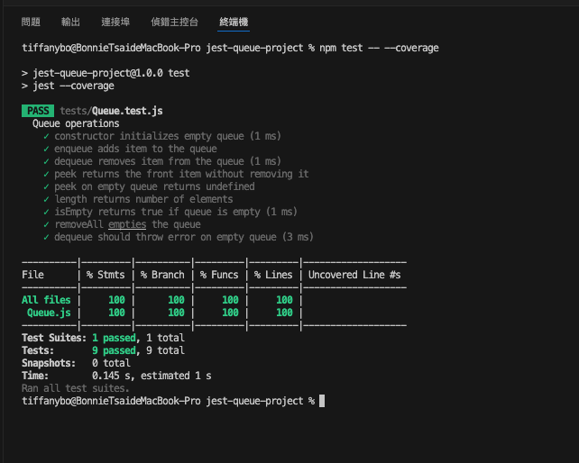
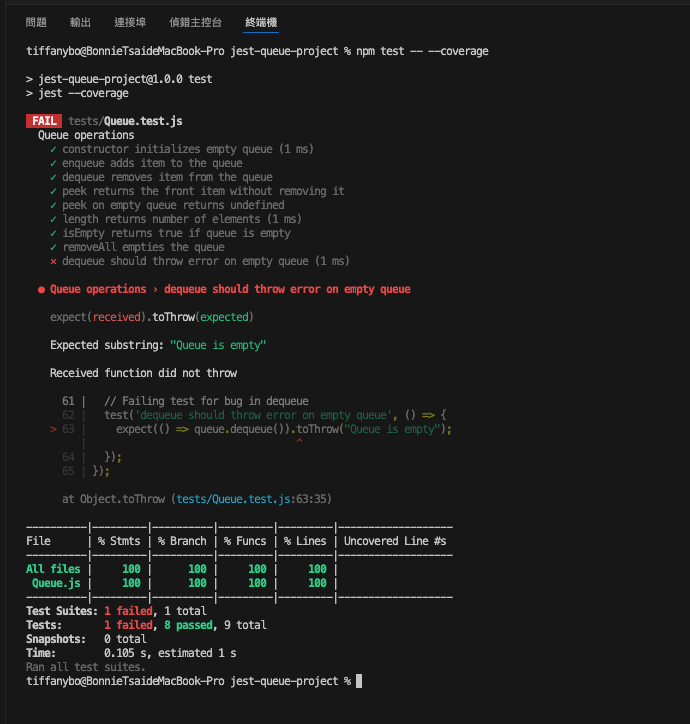

# Deploying with Containers on Virtual Machines
This project implements a basic Queue data structure in JavaScript and uses the **Jest** testing framework to validate all operations through unit tests. The goal is to achieve **100% test coverage** and demonstrate error handling, especially for the `dequeue()` method.

---

## GitHub repository link
https://github.com/tiffany9056/jest-queue-project.git

---

## Screenshots / Logs



---

## Project Structure
```
jest-queue-project/
├── coverage/         # Automatically generated after testing
├── src/            
│   └── Queue.js      # Queue implementation
├── tests/            
│   └── Queue.test.js # Jest test suite
├── screenshot/       # Screenshot of coverage after Task
├── package.json
└── README.md
```

---

## Setup Instructions
1. Install dependencies:
```bash
cd jest-queue-project
npm install
```

2. Run tests with coverage:
```bash
npm test -- --coverage
```

3. Open the HTML coverage report:
```bash
open coverage/lcov-report/index.html
```

---

## Tests Included
All the following Queue operations are fully tested:
- constructor
- enqueue(item)
- dequeue()
- peek()
- length()
- isEmpty()
- removeAll()

Includes:
- Normal cases
- Edge cases (e.g., dequeue on an empty queue)
- Branch coverage (true/false paths)